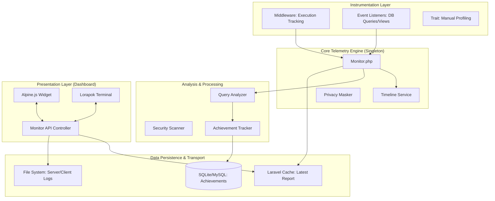

# 🏗️ Lorapok Architecture Blueprint

## 📜 System Philosophy
Lorapok is engineered as a **zero-configuration telemetry suite** for Laravel. Its primary objective is to transform raw application execution data into actionable insights through automated instrumentation, real-time analysis, and a gamified developer experience.

---

## 🛰️ High-Level Component Map

---

## 🛠️ Layer Specifications

### 1. Instrumentation Layer
The system uses "Passive Collection" strategies to minimize performance overhead:
- **Automatic**: `TrackExecutionTime` middleware captures request duration and memory spikes.
- **Deep Hooking**: Uses Laravel's `DB::listen` and `composing:*` events to intercept queries and view rendering without requiring code changes.
- **Active**: Developers can use the `monitor()` helper or `Monitor` facade for granular function-level profiling.

### 2. Core Telemetry Engine (`Monitor.php`)
Acts as the central nervous system. It maintains a non-persistent state during the request lifecycle and aggregates metrics before serializing them into a structured "Snapshot."

### 3. Analysis & Logic
| Module | Responsibility |
| :--- | :--- |
| **QueryPatternLibrary** | Identifies N+1 issues and missing indexes. |
| **SecurityScanner** | Checks for exposed `.env` variables or debug modes. |
| **AchievementTracker** | Evaluates snapshots against "Hardcore" performance goals. |
| **ServerLogParser** | Efficiently streams backend logs via chunked file reads. |

### 4. Presentation & Control
The widget is an isolated **Micro-Frontend**:
- **Framework**: Alpine.js (reactive state management).
- **Communication**: Polling-based sync with configurable intervals (Smart Polling).
- **Control**: The **Lorapok Terminal** uses a secure bridge to execute `Artisan` commands from the browser context, restricted by environment whitelists (Local/Testing).

---

## 🔐 Security Architecture
- **Environment Isolation**: The `auto_detect` feature ensures the widget is automatically stripped from production unless explicitly forced.
- **Privacy Masking**: SQL literals are masked by the `PrivacyMasker` to prevent sensitive data leakage in logs or screenshots.
- **Command Whitelisting**: Only authorized `monitor:*` commands (and common safe utilities) are executable via the web terminal.

---

## 🔄 Data Lifecycle

1.  **Bootstrap**: `ServiceProvider` initializes the `Monitor` singleton.
2.  **Intercept**: Request metrics, queries, and view paths are captured.
3.  **Finalize**: Middleware generates a unique `fingerprint` and stores the snapshot in the high-speed cache.
4.  **Notify**: If thresholds (configurable in Settings) are exceeded, alerts are dispatched to **Discord/Slack/Mail**.
5.  **Visualize**: The frontend widget polls the API, performs client-side filtering, and renders the glassmorphism dashboard.

---

## 🦋 Transformation Theme
The project follows an insect-inspired lifecycle:
- **Larvae (Capture)**: Raw, messy data is collected.
- **Pupae (Analysis)**: Data is processed and categorized.
- **Butterfly (Insights)**: Clean, beautiful, and fast application performance.

---
**Architect:** Mohammad Maizied Hasan Majumder (#MaJHiBhai)  
**Date:** January 10, 2026
