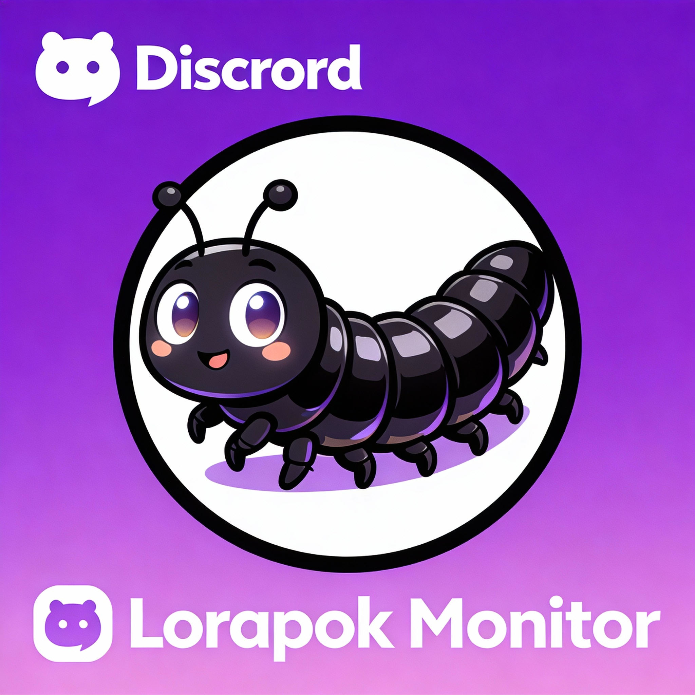

# 🚀 Lorapok - Laravel Execution Monitor

**Zero-configuration performance monitoring for Laravel applications**

#MaJHiBhai - Your friendly Laravel performance companion 🐛


## ✨ Features

### Core Monitoring
- 🎯 **Zero Configuration** - Works out of the box with sensible defaults
- 🤖 **Smart Auto-Detection** - Automatically enables in dev/local/staging, disables in production
- 🎨 **Beautiful Floating Widget** - Real-time metrics in a sleek, animated UI with dev profile
- ⚡ **Performance Tracking** - Routes, queries, functions, memory usage, timers
- 📊 **Real-Time Dashboard** - Interactive modal with tabs for overview, routes, and queries
- 💾 **Memory Profiling** - Current and peak memory usage tracking
- ⏱️ **Execution Timing** - Precise request execution and function timing measurements

### Query Management
- 📋 **Clipboard Integration** - Copy queries with one click from the widget
- ⌨️ **Keyboard Shortcuts** - Press `Ctrl+Shift+C` (or `Cmd+Shift+C` on Mac) to copy selected query
- 🗂️ **Clipboard History** - Automatic storage of last 20 copied queries in browser localStorage
- 🔍 **Query Selection** - Click to select queries with visual highlighting
- ⏱️ **Query Timing** - See execution time for each database query

### Alerts & Notifications
- 🔔 **Performance Alerts** - Automatic detection of slow routes/queries based on thresholds
- 📢 **Real-Time Broadcasting** - Pusher/Laravel Echo integration for live alerts
- 📧 **Multi-Channel Notifications** - Slack, Discord, Email, Database notification support
- 🎛️ **Threshold Configuration** - Customizable performance thresholds per feature
- 🚫 **Rate Limiting** - Built-in rate limiting to prevent alert spam

### Changelog

**v1.0.0** (2026-01-06)
- ✅ Initial release with core monitoring features
- ✅ Copy-to-clipboard for queries with history (localStorage)
- ✅ Keyboard shortcut `Ctrl+Shift+C` for quick copy
- ✅ Real-time broadcasting with Pusher/Laravel Echo
- ✅ Multi-channel notifications (Slack, Discord, Email, Database)
- ✅ Performance threshold detection and alerting
- ✅ Beautiful floating widget with developer profile
- ✅ Route, query, and function tracking
- ✅ Memory profiling and usage tracking
- ✅ Published assets for local serving of listener script
- ✅ Redesigned Settings Modal with glassmorphism UI


## 📦 Installation

```bash
composer require lorapok/laravel-execution-monitor
```

## 🔔 Discord integration



To enable Discord notifications, add the following to your application's `.env` (or set via your deployment configuration):

```
MONITOR_DISCORD_WEBHOOK=https://discordapp.com/api/webhooks/your_webhook_id/your_webhook_token
MONITOR_DISCORD_ENABLED=true
```

For local development you can also open the Lorapok widget and save a local developer webhook under Settings (stored in browser localStorage) — this is intended for developer convenience only. For production, prefer the `.env` approach.

To test sending an on-demand alert from the application, run:

```
php tools/trigger_discord_test.php
```

A GitHub Actions workflow is provided at `.github/workflows/phpunit.yml` that runs `composer install` and `phpunit` on push and pull requests.


That's it! The package automatically enables in local/dev/staging and disables in production.

### Optional: Full Installation

```bash
php artisan monitor:install
```

## 🚀 Quick Start

```php
use Lorapok\ExecutionMonitor\Facades\Monitor;

// Track execution time
Monitor::start('expensive-operation');
// ... your code
Monitor::end('expensive-operation');

// Or use a closure
$result = monitor('api-call', function() {
    return Http::get('https://api.example.com/data');
});
```

## 🎨 The Widget

A beautiful floating button appears in your application. Click it to see:
- 📊 Overview - Performance metrics at a glance
- 🛣️ Routes - All tracked routes with execution times
- 🗄️ Queries - Database queries with timing and copy-to-clipboard
- ⚡ Functions - Custom tracked functions
- 💾 Memory - Memory usage statistics


### Clipboard Features

- **Click Copy Button** - Each query has a copy button; click to copy SQL to clipboard and see "Copied!" feedback
- **Keyboard Shortcut** - Press **Ctrl+Shift+C** (or Cmd+Shift+C on Mac) to copy the selected query (or first if none selected)
- **Clipboard History** - All copied queries are stored in browser localStorage (max 20 entries) for easy access


## 📊 Check Status

```bash
# Check if monitoring is active
php artisan monitor:status

# Force enable
php artisan monitor:enable

# Disable monitoring
php artisan monitor:disable
```

## ⚙️ Configuration

Publish config (optional):

```bash
php artisan vendor:publish --tag=lorapok-config
```

Edit `config/execution-monitor.php`:

```php
return [
    'auto_detect' => true,  // Smart environment detection
    'features' => [
        'widget' => true,
        'routes' => true,
        'queries' => true,
        'functions' => true,
    ],
    'thresholds' => [
        'route' => 1000,   // ms
        'query' => 100,    // ms
    ],
];
```

## 🎭 Environment Modes

| Mode | Local | Staging | Production |
|------|-------|---------|------------|
| `local-only` (default) | ✅ | ❌ | ❌ |
| `non-production` | ✅ | ✅ | ❌ |
| `custom` | Config | Config | Config |

## 📢 Broadcasting & Real-Time Alerts

Lorapok integrates with Laravel Broadcasting to send real-time performance alerts to your team:

```env
# Configure Pusher in .env
BROADCAST_DRIVER=pusher
PUSHER_APP_ID=your_app_id
PUSHER_APP_KEY=your_app_key
PUSHER_APP_SECRET=your_secret
PUSHER_APP_CLUSTER=ap2
```

When thresholds are exceeded, performance alerts are:
- 📬 Broadcast to all connected clients in real-time
- 🔔 Sent to configured notification channels (Slack, Discord, Email)
- 💾 Optionally stored in database for audit trail

## 🎤 Notifications

Configure multiple notification channels in `config/execution-monitor.php`:

```php
'notifications' => [
    'slack' => [
        'enabled' => true,
        'webhook_url' => env('MONITOR_SLACK_WEBHOOK'),
        'channel' => '#monitoring',
    ],
    'discord' => [
        'enabled' => true,
        'webhook_url' => env('MONITOR_DISCORD_WEBHOOK'),
    ],
    'mail' => [
        'enabled' => true,
        'to' => env('MONITOR_MAIL_TO', 'admin@example.com'),
    ],
],
'rate_limiting' => [
    'enabled' => true,
    'max_per_hour' => 10,
],
```

## 📚 Advanced Usage

### In Controllers

```php
use Lorapok\ExecutionMonitor\Traits\TracksExecutionTime;

class UserController extends Controller
{
    use TracksExecutionTime;

    public function index()
    {
        $this->startTimer('user-fetch');
        $users = User::paginate(20);
        $this->endTimer('user-fetch');

        return view('users.index', compact('users'));
    }
}
```

### Helper Functions

```php
// Quick tracking
monitor()->start('task');
// ...
monitor()->end('task');

// With closure
$data = monitor('fetch-data', fn() => $this->getData());

// Check if enabled
if (execution_monitor_enabled()) {
    // monitoring code
}
```

## 🤝 Contributing

Contributions welcome! Please see [CONTRIBUTING.md](CONTRIBUTING.md).

## 📄 License

MIT License - see [LICENSE](LICENSE) file.

## 🐛 About Lorapok

**Lorapok** (inspired by Black Soldier Fly Larvae) is a lightweight, zero-config performance monitoring package for Laravel. Like its namesake insect, Lorapok works quietly in the background to identify and eliminate performance bottlenecks, helping your Laravel application become more efficient and fast.

Lorapok makes it easy for developers to:
- 🔍 Identify slow queries and routes
- 📊 Monitor memory usage in real-time
- 🚨 Set up automatic performance alerts
- 📋 Copy and analyze database queries
- 🏃 Track custom code execution

## 👨‍💻 About the Creator

<div align="center">
  
  <h3>Mohammad Maizied Hasan Majumder</h3>
  <p><strong>#MaJHiBhai</strong> - Making Laravel Fast! ⚡</p>
</div>

<div align="center">

**Lorapok** is developed and maintained by **Mohammad Maizied Hasan Majumder**

📧 Email: [mdshuvo40@gmail.com](mailto:mdshuvo40@gmail.com)  
🔗 LinkedIn: [linkedin.com/in/maizied](https://www.linkedin.com/in/maizied/)  
🐙 GitHub: [@Maijied](https://github.com/Maijied)

Made with ❤️ for the Laravel community by [@Maijied](https://github.com/Maijied)

</div>
